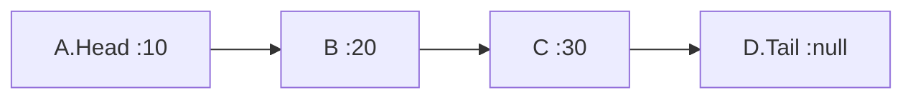
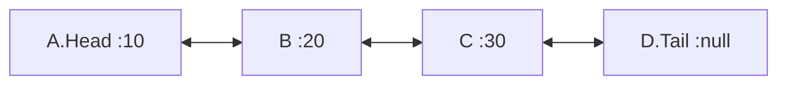
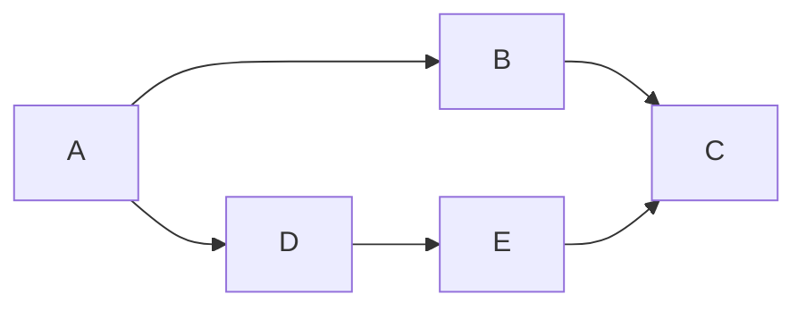
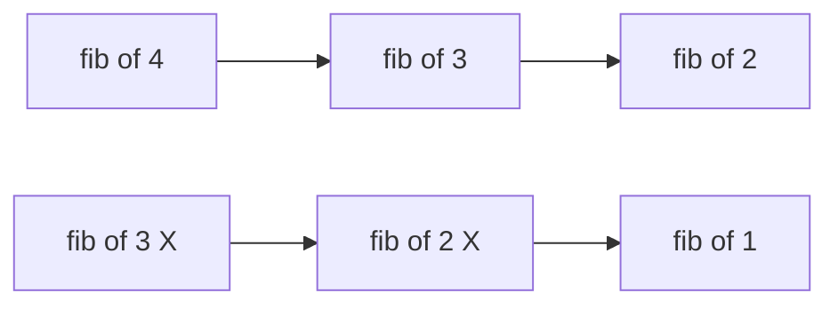

# AnandOnDSA

## Topics

> Recursion Fundamentals
1. Factorial
2. Fibonacci
3. Tower of Hanoi

> Basic Data Structures
1. Arrays
2. Singly Linked Lists
3. Doubly Linked Lists
4. Circular Linked Lists
5. Stacks
6. Queues
7. Hash Table
8. Hash Maps
9. Hash Sets

> Advanced Data Structures
1. Binary Tree
2. Binary Search Tree
3. AVL Tree
4. Segment Tree
5. Fenwick Tree
6. Graphs (Adjacency Matrix/List)
7. Depth First Search (DFS)
8. Breadth FIrst Search (BFS)
9. Shortest Path Algorithms
10. Heaps
11. Min-Heap
12. Max-Heap
13. Priority Queues
14. Tries (Prefix Trees)
15. Disjoint Sets (Union-Find)

> Sorting Algorithms
1. Bubble Sort
2. Selection Sort
3. Insertion Sort
4. Merge Sort
5. Quick Sort
6. Heap Sort
7. Counting Sort
8. Radix Sort

> Searching Algorithms
1. Linear Search
2. Binary Search
3. Search Variations (in Rotated Arrays, Matrix)

> Specialized Algorithms
1. String Matching - KMP
2. String Matching - Rabin-Karp
3. String Matching - Z-Algorithm
4. Graph Algorithms - Dijkstra’s
5. Graph Algorithms - Bellman-Ford
6. Graph Algorithms - Floyd-Warshall
7. Graph Algorithms - Kruskal’s
8. Graph Algorithms - Prim’s
9. Topological Sorting
10. Minimum Spanning Tree

> Key Algorithmic Paradigms
1. Divide and Conquer
2. Greedy Algorithms
3. Sliding Window Technique
4. Two Pointers Technique
5. Bit Manipulation
6. Kadane’s Algorithm
7. Floyd’s Cycle Detection
8. Sliding Window Problems
9. Subset Problems

> Dynamic Programming (DP)
1. Top-Down (Memoization) vs Bottom-Up (Tabulation)
2. Optimal Substructure and Overlapping Subproblems
3. Fibonacci Sequence
4. Longest Common Subsequence (LCS)
5. Longest Increasing Subsequence (LIS)
6. 0/1 Knapsack Problem
7. Matrix Chain Multiplication
8. Subset Sum Problem
9. Partition Equal Subset Sum
10. Edit Distance
11. Rod Cutting Problem
12. Egg Dropping Problem
13. Wildcard Matching
14. Grid/Matrix - Unique Paths
15. Grid/Matrix - Minimum Path Sum
16. Grid/Matrix - Maximal Square
17. Longest Palindromic Subsequence
18. Longest Palindromic Substring

> Dynamic Programming (DP) by Udemy
1. Minimum cost path problem
2. Paths in matrix
3. House robber problem
4. Longest Common Subsequence (LCS)
5. Gold mine problem
6. Edit distance
7. Ways to climb
8. Shortest Common Supersequence
9. Coin change problem
10. Subset sum problem
11. Longest increasing subsequence
12. Ways to decode
13. Partition problem
14. Rod cutting problem
15. Square matrix of ones
16. Minimum cost for tickets
17. Interleaving string
18. Sorted vowel strings
19. Word break problem
20. Matrix chain problem 


### Factorial
Factorial is a simple problem implemented with recursion

```java
private static int factorial(int n) {
  if (n<=1) return 1;
  return n*factorial(n-1);
}
```
### Fibonacci
Fibonacci is a famous problem based on golden ratio. Where an element is sum of previous two elements.
0 1 1 2 3 5 8 13 21 34 ...
```java
private static void fibonacci(int n) {
  fibonacciRecursion(n, 0, 1);
}

private static void fibonacciRecursion(int count, int n1, int n2) {
  if (count<=0) return;
  System.out.println(n1);
  fibonacciRecursion(count-1, n2, n1+n2);
}
```
### Tower of Hanoi

### Arrays
Arrays are sequence of elements based on indexes.
```java
import java.util.Arrays;

public class Main {
  public static void main(String[] args) {
    int[] data = {1, 6, 8, 2, 0, 9, 4};
    Arrays.sort(data);
    System.out.println(Arrays.toString(data));
    System.out.println(Arrays.binarySearch(data, 8));
  }
}
```

### Dynamic Array ( ArrayList )
Instead of fixes size. The size is dynamically increased. In Java **ArrayList** provides that support by default.
Initial **capacity is 10** by default. While adding more data, the size increased, by **grow & shrink** technique.
```java
grow = (capcity) -> { capacity*2 };
shrink = (capcity) -> { capacity/2 };
```
We can provide custom capacity size while creating ArrayList in Java
```java
ArrayList<Integer> list = new ArrayList<>(20);
```

### Singly Linked Lists
Dynamic Array size. So less memory comparing with Array. Insertion & deletion will be O(1) if we know the pointer location.
But it carries extra memory for pointers as well. Searching an element will be O(n).

Data structure goes like below.
```java
class Node {
  int value;
  Node next;
  Node(int value) {
    this.value = value;
  }
}

class SingleLinkedList {
  Node head;
  Node tail;
  
  SingleLinkedList() {}
  
  public void addData(int value) {
    Node newNode = new Node(value);
    if (this.head == null) {
      newNode.next = this.tail;
      this.head = newNode;
    } else {
      newNode.next = this.head.next;
      this.head.next = newNode;
    }
  }
}
```
And Java provides default implementation as well.
```java
LinkedList<String> ll = new LinkedList<String>();
ll.add("A");
ll.remove("A");
```
It can act as Stack & Queue also.
```java
\\ Stack
ll.push("S");
ll.pop();

\\ Queue
ll.offer("S");
ll.poll();
```
Provides more simple features comparing with Arrays, such as
```java
.addFirst("x");
.addLast("x");
.removeFirst("x");
.removeLast("x");
.getFirst();
.getLast();
```

### Doubly Linked Lists

In this structure each node has prev & next pointers addressing to previous and next nodes.
```java
class Node {
  Node prev;
  int value;
  Node next;
  Node(int value) {
    this.value = value;
  }
}

class DoubleLinkedList {
  Node head;
  Node tail;
  
  DoubleLinkedList() {}
  
  public void addData(int value) {
    Node newNode = new Node(value);
    if (this.head == null) {
      this.head = newNode;
      this.tail = newNode;
    } else {
      this.tail.next = newNode;
      newNode.prev = this.tail;
      this.tail = newNode;
    }
  }
}
```
The same LinkedList class in Java provide **bidirection traversal** support for double linked list.

```java
LinkedList<String> ll = new LinkedList<String>();
ll.add("A");
ll.remove("A");
```

### Circular Linked Lists

### Stacks
Last In First Out (LIFO) Structure based.
```java
static class Stack {
    int[] data;
    int pointer;
    int capacity = 100;
    
    Stack() {
      data = new int[capacity];
      pointer = -1;
    }
    void push(int value) {
      if (pointer>=capacity) {
        capacity *= 2;
        this.data = Arrays.copyOf(this.data, capacity);
      }
      pointer++;
      data[pointer] = value;
    }
    int pop() {
      if (pointer>0) {
        int value = this.data[pointer];
        pointer--;
        return value;
      }
      return -1;
    }
    void display() {
      System.out.println("\nStack:");
      for (int i=0; i<=this.pointer; i++) {
        System.out.println(this.data[i]);
      }
    }
  }
```

### Top-Down (Memoization) vs Bottom-Up (Tabulation)
**Top-Down (Memoization):**
This approach involves solving the problem recursively and storing the results of subproblems to avoid redundant computations.
Its called top-down, because its goes like *bigger to smaller* value through recursion.
```java
  private Map<Integer, Integer> memo = new HashMap<>();

  public int fib(int n) {
    if (n <= 1) {
      return n;
    }
    if (memo.containsKey(n)) {
      return memo.get(n);
    }
    int result = fib(n - 1) + fib(n - 2);
    memo.put(n, result);
    return result;
  }
```

**Bottom-Up (Tabulation):**
Its like storing every step into an array, in iterative way. When needed the correspondent value is returned from specific index.
Its called bottom-up, because its goes like *smaller to bigger* value via iteration.
```java
  public int fib(int n) {
    if (n <= 1) {
        return n;
    }
    int[] dp = new int[n + 1];
    dp[0] = 0;
    dp[1] = 1;
    for (int i = 2; i <= n; i++) {
        dp[i] = dp[i - 1] + dp[i - 2];
    }
    return dp[n];
  }
```

### Optimal Substructure and Overlapping Subproblems
**Optimal Substructure:** A problem has optimal substructure if an optimal solution can be constructed from optimal solutions of its subproblems.
*Example*
Let's say, shortest path between **A->C** is **A->B and B->C**. That means shortest path between A->B and B->C also solved while solving A->C.

**Overlapping Subproblems:** A problem has overlapping subproblems if the same subproblems are solved multiple times.
*Example*
While solving fib(4), we are calculating fib(3) & fib(2). While checking for fib(3), we may check for fib(2) again. But fib(3) & fib(2) are already solved. This is redundant. Using **Memoization** & **Tabulation** we can achieve this.


### Longest Common Subsequence (LCS)
```python
def lcs(X, Y):
    m, n = len(X), len(Y)
    dp = [[0] * (n + 1) for _ in range(m + 1)]
    for i in range(1, m + 1):
        for j in range(1, n + 1):
            if X[i-1] == Y[j-1]:
                dp[i][j] = dp[i-1][j-1] + 1
            else:
                dp[i][j] = max(dp[i-1][j], dp[i][j-1])
    return dp[m][n]

print(lcs("ABCBDAB", "BDCAB"))  # Output: 4
```
### Longest Increasing Subsequence (LIS)
```python
def lis(arr):
    n = len(arr)
    dp = [1] * n
    for i in range(1, n):
        for j in range(i):
            if arr[i] > arr[j]:
                dp[i] = max(dp[i], dp[j] + 1)
    return max(dp)

print(lis([10, 22, 9, 33, 21, 50, 41, 60, 80]))  # Output: 6
```

### 0/1 Knapsack Problem
```python
def knapsack(W, wt, val, n):
    dp = [[0 for _ in range(W + 1)] for _ in range(n + 1)]
    for i in range(n + 1):
        for w in range(W + 1):
            if i == 0 or w == 0:
                dp[i][w] = 0
            elif wt[i-1] <= w:
                dp[i][w] = max(val[i-1] + dp[i-1][w-wt[i-1]], dp[i-1][w])
            else:
                dp[i][w] = dp[i-1][w]
    return dp[n][W]

print(knapsack(50, [10, 20, 30], [60, 100, 120], 3))  # Output: 220
```

### Matrix Chain Multiplication
```python
def matrix_chain_order(p):
    n = len(p) - 1
    dp = [[0] * n for _ in range(n)]
    for l in range(2, n + 1):
        for i in range(n - l + 1):
            j = i + l - 1
            dp[i][j] = float('inf')
            for k in range(i, j):
                q = dp[i][k] + dp[k+1][j] + p[i] * p[k+1] * p[j+1]
                if q < dp[i][j]:
                    dp[i][j] = q
    return dp[0][n-1]

print(matrix_chain_order([1, 2, 3, 4]))  # Output: 18
```

### Subset Sum Problem
```python
def is_subset_sum(arr, sum):
    n = len(arr)
    dp = [[False] * (sum + 1) for _ in range(n + 1)]
    for i in range(n + 1):
        dp[i][0] = True
    for i in range(1, n + 1):
        for j in range(1, sum + 1):
            if j < arr[i-1]:
                dp[i][j] = dp[i-1][j]
            else:
                dp[i][j] = dp[i-1][j] or dp[i-1][j-arr[i-1]]
    return dp[n][sum]

print(is_subset_sum([3, 34, 4, 12, 5, 2], 9))  # Output: True
```
### Partition Equal Subset Sum
```python
def can_partition(nums):
    total_sum = sum(nums)
    if total_sum % 2 != 0:
        return False
    subset_sum = total_sum // 2
    dp = [False] * (subset_sum + 1)
    dp[0] = True
    for num in nums:
        for i in range(subset_sum, num - 1, -1):
            dp[i] = dp[i] or dp[i - num]
    return dp[subset_sum]

print(can_partition([1, 5, 11, 5]))  # Output: True
```

### Edit Distance
```python
def edit_distance(str1, str2):
    m, n = len(str1), len(str2)
    dp = [[0] * (n + 1) for _ in range(m + 1)]
    for i in range(m + 1):
        for j in range(n + 1):
            if i == 0:
                dp[i][j] = j
            elif j == 0:
                dp[i][j] = i
            elif str1[i-1] == str2[j-1]:
                dp[i][j] = dp[i-1][j-1]
            else:
                dp[i][j] = 1 + min(dp[i-1][j], dp[i][j-1], dp[i-1][j-1])
    return dp[m][n]

print(edit_distance("kitten", "sitting"))  # Output: 3
```
### Rod Cutting Problem
```python
def rod_cutting(price, n):
    dp = [0] * (n + 1)
    for i in range(1, n + 1):
        max_val = float('-inf')
        for j in range(i):
            max_val = max(max_val, price[j] + dp[i-j-1])
        dp[i] = max_val
    return dp[n]

print(rod_cutting([1, 5, 8, 9, 10, 17, 17, 20], 8))  # Output: 22
```

### Egg Dropping Problem
```python
def egg_drop(n, k):
    dp = [[0] * (k + 1) for _ in range(n + 1)]
    for i in range(1, n + 1):
        for j in range(1, k + 1):
            if i == 1:
                dp[i][j] = j
            elif j == 1:
                dp[i][j] = 1
            else:
                dp[i][j] = float('inf')
                for x in range(1, j + 1):
                    res = 1 + max(dp[i-1][x-1], dp[i][j-x])
                    if res < dp[i][j]:
                        dp[i][j] = res
    return dp[n][k]

print(egg_drop(2, 10))  # Output: 4
```

### Wildcard Matching
```python
def is_match(s, p):
    m, n = len(s), len(p)
    dp = [[False] * (n + 1) for _ in range(m + 1)]
    dp[0][0] = True
    for j in range(1, n + 1):
        if p[j-1] == '*':
            dp[0][j] = dp[0][j-1]
    for i in range(1, m + 1):
        for j in range(1, n + 1):
            if p[j-1] == '*':
                dp[i][j] = dp[i][j-1] or dp[i-1][j]
            elif p[j-1] == '?' or s[i-1] == p[j-1]:
                dp[i][j] = dp[i-1][j-1]
    return dp[m][n]

print(is_match("adceb", "*a*b"))  # Output: True
```

### Grid/Matrix - Unique Paths
```python
def unique_paths(m, n):
    dp = [[1] * n for _ in range(m)]
    for i in range(1, m):
        for j in range(1, n):
            dp[i][j] = dp[i-1][j] + dp[i][j-1]
    return dp[m-1][n-1]

print(unique_paths(3, 7))  # Output: 28
```

### Grid/Matrix - Minimum Path Sum
```python
def min_path_sum(grid):
    m, n = len(grid), len(grid[0])
    dp = [[0] * n for _ in range(m)]
    dp[0][0] = grid[0][0]
    for i in range(1, m):
        dp[i][0] = dp[i-1][0] + grid[i][0]
    for j in range(1, n):
        dp[0][j] = dp[0][j-1] + grid[0][j]
    for i in range(1, m):
        for j in range(1, n):
            dp[i][j] = min(dp[i-1][j], dp[i][j-1]) + grid[i][j]
    return dp[m-1][n-1]

print(min_path_sum([[1,3,1],[1,5,1],[4,2,1]]))  # Output: 7
```

### Grid/Matrix - Maximal Square
```python
def maximal_square(matrix):
    if not matrix:
        return 0
    m, n = len(matrix), len(matrix[0])
    dp = [[0] * (n + 1) for _ in range(m + 1)]
    max_side = 0
    for i in range(1, m + 1):
        for j in range(1, n + 1):
            if matrix[i-1][j-1] == '1':
                dp[i][j] = min(dp[i-1][j], dp[i][j-1], dp[i-1][j-1]) + 1
                max_side = max(max_side, dp[i][j])
    return max_side * max_side

print(maximal_square([
    ["1","0","1","0","0"],
    ["1","0","1","1","1"],
    ["1","1","1","1","1"],
    ["1","0","0","1","0"]
]))  # Output: 4
```

### Longest Palindromic Subsequence
```python
def longest_palindromic_subseq(s):
    n = len(s)
    dp = [[0] * n for _ in range(n)]
    for i in range(n):
        dp[i][i] = 1
    for cl in range(2, n + 1):
        for i in range(n - cl + 1):
            j = i + cl - 1
            if s[i] == s[j] and cl == 2:
                dp[i][j] = 2
            elif s[i] == s[j]:
                dp[i][j] = dp[i+1][j-1] + 2
            else:
                dp[i][j] = max(dp[i][j-1], dp[i+1][j])
    return dp[0][n-1]

print(longest_palindromic_subseq("bbbab"))  # Output: 4
```

### Longest Palindromic Substring
```python
def longest_palindromic_substring(s):
    n = len(s)
    if n == 0:
        return ""
    dp = [[False] * n for _ in range(n)]
    start, max_length = 0, 1
    for i in range(n):
        dp[i][i] = True
    for i in range(n-1):
        if s[i] == s[i+1]:
            dp[i][i+1] = True
            start = i
            max_length = 2
    for length in range(3, n + 1):
        for i in range(n - length + 1):
            j = i + length - 1
            if dp[i+1][j-1] and s[i] == s[j]:
                dp[i][j] = True
                start = i
                max_length = length
    return s[start:start + max_length]


print(longest_palindromic_substring("babad"))  # Output: "bab" or "aba"
```


### Paths in matrix

If we start from top (0, 0) position, to reach bottom right (n, m), how many ways we have ?
considering the blocks we have among the ways.

| O | O | # | O | # |
| -------- | ------- | ------- | ------- | ------- |
| O | O | O | O | # |
| O | O | # | O | O |
| # | O | O | O | O |

```python
def move(i, j):
  if i==n-1 and j==m-1: return 1    # goal cell
  if mat[i][j]==1: return 0         # blocks
  if i>m or j>n: return 0           # edge scenario
  return move(i+1, j) + move(i, j+1)
```

### House robber problem
A thief trying to rob houses in a street. Security system will detect & warn if any adjacent houses of robbed. Robber to make sure to collect most possible from houses which aren't adjacent.
| 2 | 10 | 3 | 6 | 8 | 1 | 7 |
| --- | --- | --- | --- | --- | --- | --- |

The solution is
| 2 | <10> | 3 | 6 | <8> | 1 | <7> |
| --- | --- | --- | --- | --- | --- | --- |

```python
def rob(i):
  if i>n-1: return 0
  return max(
    rob(i+1),
    rob(i+2) + mat[i]
  )
```

### Longest Common Subsequence (LCS)

s1 = __ab__ da __c__ b __a__ b
s2 = __a__ ce __b__ f __ca__

And the answer is 
```python
"abca"
```
```python
def move(i, j):
  if i>n-1 or j>m-1: return 0
  if s1[i]==s2[j]:
    return move(i+1, j+1)+1
  return max( move(i+1, j), move(i, j+1) )
```

### Gold mine problem
Start from anywhere on the top row. And move only to bottom-right or just-bottom or bottom-left. Find the path which yields maximum mining.

| 3 | 2 | 12 | 15 | 10 |
| -------- | ------- | ------- | ------- | ------- |
| 6 | 19 | 7 | 11 | 17 |
| 8 | 5 | 12 | 32 | 21 |
| 3 | 20 | 2 | 9 | 7 |

The maximum path is,

| 3 | 2 | 12 | <15> | 10 |
| -------- | ------- | ------- | ------- | ------- |
| 6 | 19 | 7 | 11 | <17> |
| 8 | 5 | 12 | <32> | 21 |
| 3 | 20 | 2 | <9> | 7 |

```python
def move(i, j):
  if i>n-1 or j>m-1 or j<0: return 0    # edge case
  if i==n-1: return mine[i][j]          # edge case.. last row
  return mine[i][j] + max( move(i+1, j),
            max( move(i+1, j+1), move(i+1, j-1) )
        )
```

### Edit distance


### Ways to climb

| Jumps | 2 | 4 | 5 | 8 |
| -------- | -------- | -------- | -------- | -------- |

And n=10

__Output: 11__

```python
def move(i, moved):
  if moved==n: return 1
  if i>length-1 or moved>n: return 0
  return max(
    move(i,   moved+j[i]),
    move(i+1, moved+j[i])
  )
```


### Shortest Common Supersequence ( SCS )

Let's say
s1 = "abdacbab"
s2 = "acebfca"

The SCS would be like, **abdacebfcab**

```python
def scs(s1, s2, i=0, j=0):
  if i==len(s1):
    return len(s2)-j
  elif j==len(s2):
    return len(s1)-i
  elif s1[i]==s2[j]:
    return 1+scs(s1, s2, i+1, j+1)
  else:
    return 1+min(
      scs(s1, s2, i+1, j),
      scs(s1, s2, i, j+1)
    )
```


### Coin change problem

| Coins | 1 | 20 | 25 |
| -------- | -------- | -------- | -------- |

Amount = 80

Here, the greedy solution **25+25+25+25+1+1+1+1+1** is not giving minimal number of coins. The Dynamic Programming solution is **20+20+20+20**.

```python
def get_coins(amount):
  if amount==0: return 0
  min_coins = 'infi'
  for coin in coins:
    if (amount-coin)>=0:
      min_coins = min( min_coins, 1+get_Coins(amount-coin) )
  return min_coins
```

### 0-1 knapsack problem

| values | 20 | 30 | 15 | 25 | 10 |
| -------- | -------- | -------- | -------- | -------- | -------- |
| weights | 6 | 13 | 5 | 10 | 3 |

k = 20

The goal is to obtain maximum amount of value covering the not greater than k amount of weight.

```python
def knapsack(i, weight):
  if weight==0: return 0
  if weights[i]>weight: return knapsack(i+1, weight)
  else :
    return max(
        values[i]+knapsack(i+1, weight-weights[i]),
        knapsack(i+1, weight)
      )

knapsack(0, k)
```


### Subset sum problem

Array = [1, 2, 3, 1, 4]
k = 6
The subsets, which gonna give sum 6 are,
[1, 2, 3], [1, 1, 4], [2, 3, 1], [2, 4]

So, the answer is **4**

```python
def subset(k, i=0):
  if k==0: return 1
  elif i==len(arr) or k<0: return 0
  return subsets(k-arr[i], i+1) + subsets(k, i+1)
```

### Longest increasing subsequence ( LIS )

```python
def lis(i=0, prev=float("-inf")):
  if i==len(arr): return 0
  elif arr[i]<=prev: return lis(i+1, prev)
  else:
    return max(
      1+lis(i+1, arr[i]),
      lis(i+1, prev)
    )
```

### Ways to decode

If numbers are assigned to alphabets as,
1->A, 2->B, 3->C, 4->D, 5->E,.. 25->Y, 26->Z

Then there are **4** ways to decode below series of numbers.
s = "512810120129"

5 1 2 8 10 1 20 1 2 9
5 1 2 8 10 1 20 12 9
5 12 8 10 1 20 1 2 9
5 12 8 10 1 20 12 9

```python
def ways(s, i=0):
  if i==len(s): return 1
  elif s[i]=="0": return 0
  elif i+1 < len(s) and "10"<=s[i]+s[i+1]<="26":
    return ways(s, i+1)+ways(s, i+2)
  else:
    return ways(s, i+1)
```

### Partition problem
Check if we get two subset from an array, with same sum of subsets. 

```python
def partition(i=0, sum1=0, sum2=0):
  if i==len(arr): return sum1==sum2
  else:
    return partition(i+1, sum1+arr[i], sum2) or
           partition(i+1, sum1, sum2+arr[i])
```


### Rod cutting problem
Let's says there is a rod with length 8
We want to cut that int pieces, so that each piece price will maxmise the whole price.
prices = [0, 1, 3, 5, 6, 7, 9, 10, 11]

Output will be **13**, as we can split 8 into -> 2+3+3
On the index based, we will get maximum price,
prices[2]+prices[3]+prices[3] => 3+5+5 => **13**

```python
def rod(prices, n):
  max price = 0
  for length in range(1, n+1):
    max_price = max(max_price,
                    prices[length]+rod(prices, n-length))
  return max_price
```


### Square matrix of ones
Find the area of the greatest square submatrix full of ones.
Matrix,

| 0 | 0 | 1 | 1 | 1 | 0 |
| -------- | -------- | -------- | -------- | -------- | -------- |
| 1 | 0 | 1 | 1 | 1 | 1 |
| 0 | 1 | 1 | 1 | 1 | 0 |
| 1 | 1 | 1 | 1 | 0 | 1 |
| 0 | 1 | 0 | 1 | 1 | 1 |

Here, the maximum area it covers is **9**, as per below output.

| 0 | 0 | **1** | **1** | **1** | 0 |
| -------- | -------- | -------- | -------- | -------- | -------- |
| 1 | 0 | **1** | **1** | **1** | 1 |
| 0 | 1 | **1** | **1** | **1** | 0 |
| 1 | 1 | 1 | 1 | 0 | 1 |
| 0 | 1 | 0 | 1 | 1 | 1 |

```python
def rec(matrix, i, j):
  if i<0 or j<0 or matrix[i][j]==0: return 0
  else:
    return 1+min(
            rec(matrix, i-1, j),
            rec(matrix, i, j-1),
            rec(matrix, i-1, j-1)
          )

def square(matrix):
  n, m = len(matrix), len(matrix[0])
  max_size = 0
  for i in range(n):
    for j in range(m):
      max_size = max(max_size, rec(matrix, i, j))
  return max_size**2
```

### Minimum cost for tickets
train_days = [1, 3, 8, 9, 22, 23, 28, 31]
costs = [4, 10, 25]
n = 32
days = [1, 7, 30] # its constant

| 0 | 1* | 2 | 3*| 4 | 5..7 | 8* | 9* | 10..21 | 22* | 23* | 24..27 | 28* | 29| 30 | 31* |
| ------ | ------ | ------ | ------ | ------ | ------ | ------ | ------ | ------ | ------ | ------ | ------ | ------ | ------ | ------ | ------ |

Best way is to to buy,
1-day ticket [cost-4] = [days 1]
7-day ticket [cost-7] = [days 3, 8, 9]
7-day ticket [cost-7] = [days 22, 23, 28]
1-day ticket [cost-4] = [days 31]

Total cost -> **28**

```python
def cost(n, day=0):
  if day>=n: return 0
  elif day not in train_days:
    return cost(n, day+1)
  else:
    return min(
          costs[0] + cost(n, day+1),
          costs[1] + cost(n, day+7),
          costs[2] + cost(n, day+30)
        )
```

### Interleaving string
s1 = "aabcc"
s2 = "dbbca"

s3 = "aadbbcbcac"

```python
def move(i, j):
  if len(s1)+len(s2) != len(s3): return False
  if i==len(s1) and j==len(s2): return True
  else:
    check_s1 = i<len(s1) and s1[i]==s3[i+j] and move(i+1, j)
    check_s2 = j<len(s2) and s2[j]==s3[i+j] and move(i, j+1)
    return check_s1 or check_s2
```

### Sorted vowel strings


### Word break problem


### Matrix chain problem 


