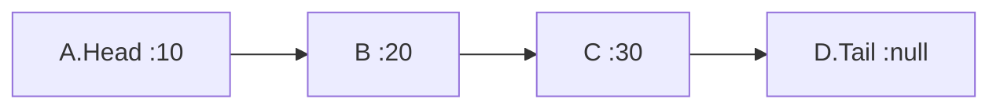

# AnandOnDSA

## Topics

> Recursion Fundamentals
1. Factorial
2. Fibonacci
3. Tower of Hanoi

> Basic Data Structures
1. Arrays
2. Singly Linked Lists
3. Doubly Linked Lists
4. Circular Linked Lists
5. Stacks
6. Queues
7. Hash Table
8. Hash Maps
9. Hash Sets

> Advanced Data Structures
1. Binary Tree
2. Binary Search Tree
3. AVL Tree
4. Segment Tree
5. Fenwick Tree
6. Graphs (Adjacency Matrix/List)
7. Depth First Search (DFS)
8. Breadth FIrst Search (BFS)
9. Shortest Path Algorithms
10. Heaps
11. Min-Heap
12. Max-Heap
13. Priority Queues
14. Tries (Prefix Trees)
15. Disjoint Sets (Union-Find)

> Sorting Algorithms
1. Bubble Sort
2. Selection Sort
3. Insertion Sort
4. Merge Sort
5. Quick Sort
6. Heap Sort
7. Counting Sort
8. Radix Sort

> Searching Algorithms
1. Linear Search
2. Binary Search
3. Search Variations (in Rotated Arrays, Matrix)

> Specialized Algorithms
1. String Matching - KMP
2. String Matching - Rabin-Karp
3. String Matching - Z-Algorithm
4. Graph Algorithms - Dijkstra’s
5. Graph Algorithms - Bellman-Ford
6. Graph Algorithms - Floyd-Warshall
7. Graph Algorithms - Kruskal’s
8. Graph Algorithms - Prim’s
9. Topological Sorting
10. Minimum Spanning Tree

> Key Algorithmic Paradigms
1. Divide and Conquer
2. Greedy Algorithms
3. Sliding Window Technique
4. Two Pointers Technique
5. Bit Manipulation
6. Kadane’s Algorithm
7. Floyd’s Cycle Detection
8. Sliding Window Problems
9. Subset Problems

> Dynamic Programming (DP)
1. Top-Down (Memoization) vs Bottom-Up (Tabulation)
2. Optimal Substructure and Overlapping Subproblems
3. Fibonacci Sequence
4. Longest Common Subsequence (LCS)
5. Longest Increasing Subsequence (LIS)
6. 0/1 Knapsack Problem
7. Matrix Chain Multiplication
8. Subset Sum Problem
9. Partition Equal Subset Sum
10. Edit Distance
11. Rod Cutting Problem
12. Egg Dropping Problem
13. Wildcard Matching
14. Grid/Matrix - Unique Paths
15. Grid/Matrix - Minimum Path Sum
16. Grid/Matrix - Maximal Square
17. Longest Palindromic Subsequence
18. Longest Palindromic Substring


### Factorial
Factorial is a simple problem implemented with recursion

```java
private static int factorial(int n) {
  if (n<=1) return 1;
  return n*factorial(n-1);
}
```
### Fibonacci
Fibonacci is a famous problem based on golden ratio. Where an element is sum of previous two elements.
0 1 1 2 3 5 8 13 21 34 ...
```java
private static void fibonacci(int n) {
  fibonacciRecursion(n, 0, 1);
}

private static void fibonacciRecursion(int count, int n1, int n2) {
  if (count<=0) return;
  System.out.println(n1);
  fibonacciRecursion(count-1, n2, n1+n2);
}
```
### Tower of Hanoi

### Arrays
Arrays are sequence of elements based on indexes.
```java
import java.util.Arrays;

public class Main {
  public static void main(String[] args) {
    int[] data = {1, 6, 8, 2, 0, 9, 4};
    Arrays.sort(data);
    System.out.println(Arrays.toString(data));
    System.out.println(Arrays.binarySearch(data, 8));
  }
}
```

### Dynamic Array ( ArrayList )
Instead of fixes size. The size is dynamically increased. In Java **ArrayList** provides that support by default.
Initial **capacity is 10** by default. While adding more data, the size increased, by **grow & shrink** technique.
```java
grow = (capcity) -> { capacity*2 };
shrink = (capcity) -> { capacity/2 };
```
We can provide custom capacity size while creating ArrayList in Java
```java
ArrayList<Integer> list = new ArrayList<>(20);
```

### Singly Linked Lists



### Doubly Linked Lists
### Circular Linked Lists
